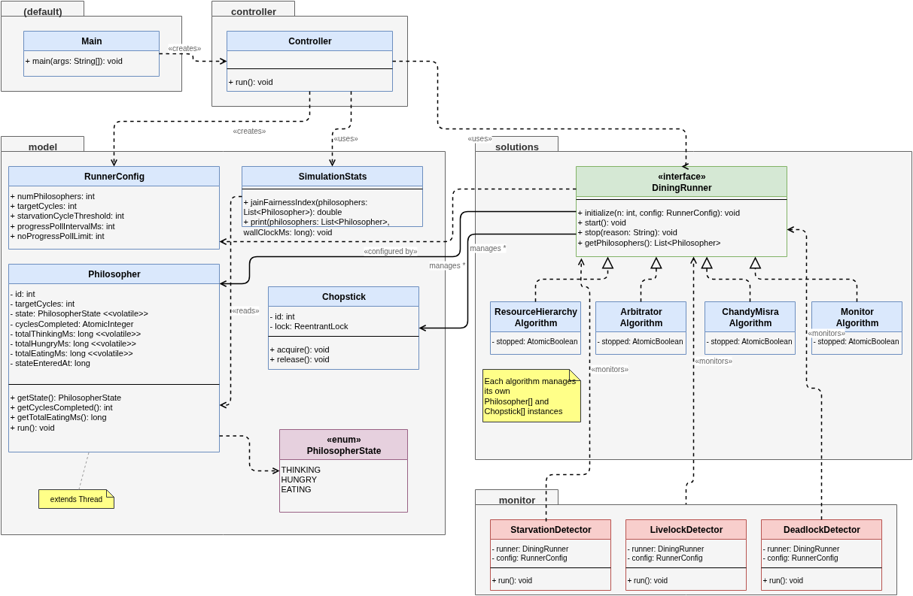

# Dining Philosophers — Java Implementation

A simulation of the Dining Philosophers Problem implementing four classic concurrency algorithms in Java. See [`docs/DiningPhilosophersProblem.md`](docs/DiningPhilosophersProblem.md) for the full analysis.

## Prerequisites

- Java 17+
- `make`
- `curl` (for downloading dependencies)

## Quick Start

```
make        # compile
make run    # launch interactive simulator
```

---

## Make Targets

| Target | Description |
|---|---|
| `all` | Compile all main Java sources into `out/`. This is the default target. |
| `run` | Compile (if needed) and launch the interactive simulator. |
| `libs` | Download all dependencies — JCIP annotations, JUnit 5, and JaCoCo — into `lib/`. Required before running `test` or `coverage`. |
| `compile-tests` | Compile test sources from `src/test/` into `out-test/`. Depends on `libs`. |
| `test` | Compile and run all JUnit 5 tests. |
| `coverage` | Run tests under the JaCoCo agent and generate a CSV coverage report to `coverage/jacoco.csv`. |
| `spotbugs` | Run SpotBugs static analysis on compiled classes. Report written to `reports/spotbugs.txt`. Downloads SpotBugs on first run. |
| `checkstyle` | Run CheckStyle (Google style) on all sources. Report written to `reports/checkstyle.txt`. Downloads CheckStyle on first run. |
| `analyze` | Run both `spotbugs` and `checkstyle` in sequence. |
| `javadoc` | Generate Javadoc for all packages to `docs/javadoc/`. |
| `clean` | Delete all generated files and downloaded libraries (`out/`, `out-test/`, `coverage/`, `lib/`, `reports/`, `docs/javadoc/`). |
| `help` | Print a summary of all available targets. |

## Additional Documentation

| File | Description |
|---|---|
| `docs/DiningPhilosophersProblem.md` | Full written analysis — problem background, algorithm designs, Java implementation decisions, simulation results, and comparison across N=5/15/21 philosophers. |
| `docs/DiningPhilosophersProblem.pdf` | PDF export of the analysis document above. |
| `docs/DiningPhilosophers.pptx` | Presentation slides used for the CPSC543 class presentation. |
| `docs/Instructions.md` | Original assignment instructions and peer grading rubric. |

---

## Java Code Structure

```
src/
  Main.java                       entry point
  controller/Controller.java      CLI menu and simulation orchestration
  model/                          Philosopher, Chopstick, state, config, stats
  solutions/                      Four algorithm implementations
    ResourceHierarchyAlgorithm    ordered lock acquisition (Dijkstra)
    ArbitratorAlgorithm           central waiter with wait/notifyAll
    ChandyMisraAlgorithm          dirty/clean message passing via BlockingQueue
    MonitorAlgorithm              shared state + per-philosopher Condition
  monitor/                        Deadlock, livelock, and starvation detectors
  test/                           JUnit 5 tests mirroring the source package structure
docs/                             analysis document, slides, peer reviews, javadoc
drawio/                           draw.io source files and exported PNGs for diagrams
```

### Class Diagram of Solution


