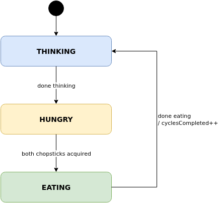
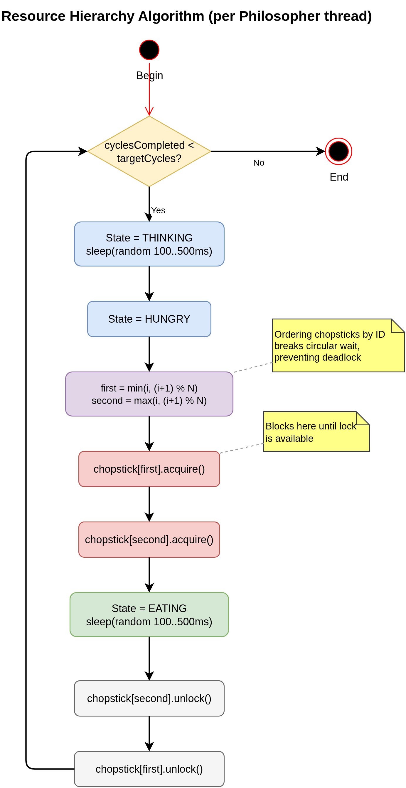
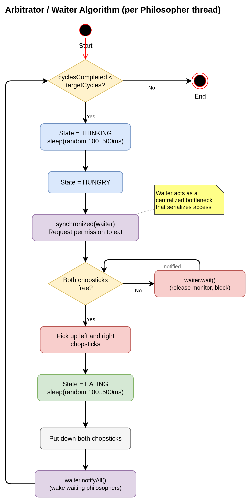
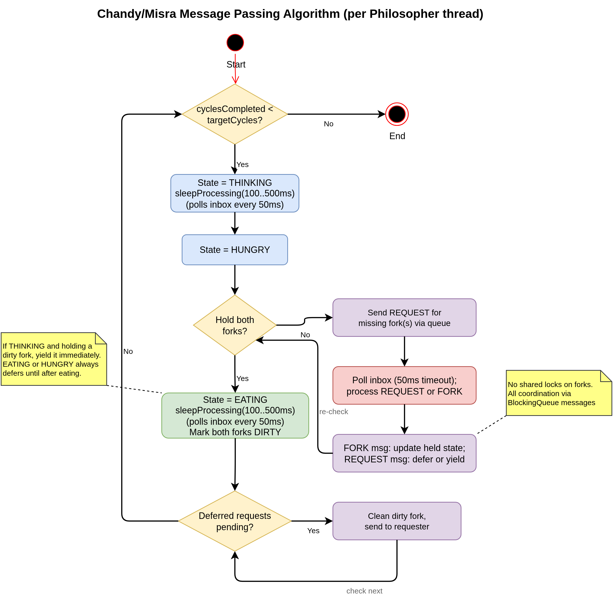
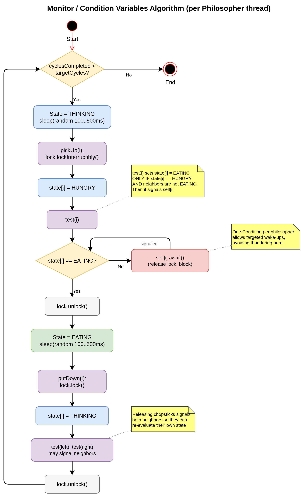

# Analysis of the Dining Philosophers Problem in Java

This document explores the Dining Philosophers Problem and its various approaches to solving the synchronization and deadlock issues. It examines the classic solution using ordered lock acquisition, as well as more advanced techniques like message passing and monitors. The focus is on understanding the challenges of concurrent programming and the trade-offs between different synchronization mechanisms. The implementation of these solutions in Java is analyzed in detail, highlighting the design decisions and trade-offs involved in applying each approach.

## The Dining Philosophers Problem
The Dining Philosophers Problem is one of the most iconic concurrency problems in computer science, originally introduced by Edsger Dijkstra in 1965 [3] as an exam problem relating to computers competing for access to shared resources. The problem, as now known, was reformuated by Tony Hoare to illustrate the challenges of resource allocation and synchronization in concurrent systems.

### The Problem As Written By Hoare

The text below is a copy of the original problem statement from the book **Communicating Sequential Processes** by C.A.R. Hoare[1].

#### _2.5 Example: The Dining Philosophers_
_In ancient times, a wealthy philanthropist endowed a College to accommodate five eminent philosophers. Each philosopher had a room in which he could engage in his professional activity of thinking; there was also a common dining room, furnished with a circular table, surrounded by five chairs, each labelled by the name of the philosopher who was to sit in it. The names of the philosophers were PHIL0, PHIL1, PHIL2, PHIL3, PHIL4, and they were disposed in this order anticlockwise around the table. To the left of each philosopher there was laid a golden fork, and in the centre stood a large bowl of spaghetti, which was
constantly replenished. A philosopher was expected to spend most of his time thinking; but when he felt hungry, he went to the dining room, sat down in his own chair, picked up his own fork on his left, and plunged it into the spaghetti. But such is the tangled nature of spaghetti that a second fork is required to carry it to the mouth. The philosopher therefore had also to pick up the fork on his right. When we was finished he would put down both his forks, get up from his chair, and continue thinking. Of course, a fork can be used by only one philosopher at a time.  If the other philosopher wants it, he just has to wait until the fork is available again._

### Brief Problem Statement [2]
Five philosophers sit around a circular table. Between each pair of adjacent philosophers lies a single chopstick (five total). Each philosopher progresses cyclically through the following states:

- **Thinking** — requires no resources
- **Eating** — requires both the left and right chopstick simultaneously

#### Philosopher state machine:



*Source: [drawio/philosopher-state-machine.drawio](../drawio/philosopher-state-machine.drawio)*

A philosopher can only pick up one chopstick at a time, and cannot use a chopstick already held by a neighbor.

The task is to devise an algorithm for allocating resources (chopsticks) among the philosophers with the following properties:

- prevents deadlocks
- prevents starvation (literally in this case...)

### Core Concurrency Hazards Illustrated By This Problem
1. **Deadlock**<br>
   If every philosopher simultaneously picks up their left chopstick, none can pick up their right — they wait forever. This is the classic circular-wait deadlock.
2. **Starvation**<br>
   Even without deadlock, a philosopher may never get to eat if neighbors repeatedly acquire the chopsticks first.
3. **Livelock**<br>
   Philosophers can repeatedly pick up and put down chopsticks in lockstep, making no progress despite being active.
4. **Race Conditions**<br>
   Without proper synchronization, two philosophers might both believe they've acquired the same chopstick.

### Solution Strategies Examined Here
There are a number of approaches described in the literature, and there is a significant amount of variation in how each solution is implemented. In order to constrain scope and stay focused on solutions that utilize Java concurrency toolsets, we will examine these four common approaches:
1. Resource Hierarchy (Dijkstra's Original) [3]
   Number the chopsticks 0 through N-1. Each philosopher always picks up the lower-numbered chopstick first. This breaks the circular-wait condition, eliminating deadlock. It's simple but can cause starvation.
1. Arbitrator / Waiter Pattern [2]
   A central "waiter" controls access — a philosopher must ask permission before picking up chopsticks. The waiter only grants permission if both are available. This prevents deadlock but introduces a bottleneck and reduces parallelism.
1. Chandy/Misra (Message Passing) [4]
   Chopsticks are passed between philosophers via requests and replies, with a "dirty/clean" token to ensure fairness. Eliminates both deadlock and starvation but is complex to implement.
1. Monitor / Condition Variable Approach [5]
   Each philosopher's state (THINKING, HUNGRY, EATING) is tracked. A philosopher only picks up chopsticks when both neighbors are not eating, enforced via a monitor and condition variables. This is the most natural fit for Java's concurrency model.

## How These Techniques Can Be Applied Using Java

Java provides several mechanisms that map directly onto these solutions:

| **Solution** | **Java Mechanisms** |
|--------------------------------|--------------------------------|
| Resource Hierarchy | `synchronized`, `ReentrantLock` (ordered acquisition) |
| Arbitrator / Waiter | centralized `synchronized` monitor; waiting philosophers call `wait()`, waiter calls `notifyAll()` |
| Monitor / Condition Variables | `synchronized` + `wait()`/`notifyAll()`, `ReentrantLock` + `Condition` |
| Chandy/Misra Message Passing | `BlockingQueue`, actor-style threading |

### All Four Solutions in Java

1. **Resource Hierarchy**<br>
   Straightforward to implement in Java with nothing more than synchronized blocks or ReentrantLock. Each chopstick is a shared object, and philosophers simply acquire locks in a globally consistent numeric order. No special concurrency primitives are required — the deadlock prevention is entirely in the logic, not the mechanism.
1. **Arbitrator / Waiter**<br>
   Implemented with a `synchronized` method on a central `Waiter` object that checks availability before granting access; waiting philosophers call `wait()` and the waiter calls `notifyAll()` on each release.
1. **Monitor / Condition Variables**<br>
   The most idiomatic Java approach. Uses synchronized + wait()/notifyAll(), or more explicitly, ReentrantLock with named Condition objects (one per philosopher), allowing targeted wake-ups rather than broadcasting to all threads.
1. **Chandy/Misra (Message Passing)**<br>
   Implemented in Java using one `LinkedBlockingQueue` per philosopher as a message inbox. Both neighboring philosophers write directly into that inbox; a `senderId` field in every message identifies which neighbor sent it. Each philosopher runs its own thread and communicates purely through queues — no shared lock on the chopstick objects themselves. Java's `java.util.concurrent` package makes this quite clean.

## Solution Designs

### 1. `ResourceHierarchyAlgorithm` [3]

- Each chopstick is numbered 0 through N-1.
- Each philosopher always acquires the lower-numbered chopstick before the higher-numbered one.
- Breaks circular-wait, eliminating deadlock.
- Uses `ReentrantLock`; no special primitives.
- Risk: starvation is possible (no fairness guarantee).

```
Philosopher i acquires: min(i, (i+1)%N) first, then max(i, (i+1)%N)
```



*Source: [drawio/activity-resource-hierarchy.drawio](../drawio/activity-resource-hierarchy.drawio)*

### 2. `ArbitratorAlgorithm` [2]

- A central `Waiter` controls access. A philosopher requests permission before picking up either chopstick; the waiter grants only when both adjacent chopsticks are free.
- Implemented with a `synchronized` method on the waiter; waiting philosophers call `wait()` and the waiter calls `notifyAll()` on each release.
- Eliminates deadlock; reduces parallelism to at most ⌊N/2⌋ eating simultaneously.



*Source: [drawio/activity-arbitrator.drawio](../drawio/activity-arbitrator.drawio)*

### 3. `ChandyMisraAlgorithm` [4]

- Each chopstick is either *clean* or *dirty* and owned by exactly one philosopher.
- Initially all chopsticks are dirty, held by the lower-numbered neighbor.
- A philosopher wanting a held chopstick sends a request via `LinkedBlockingQueue`.
- If the holder is THINKING and the fork is dirty, it is cleaned and sent immediately. If the holder is EATING or HUNGRY, the request is deferred regardless of the fork's state; the fork is sent after eating completes when the deferred flags are drained.
- All coordination is through message passing — no shared locks on chopstick objects.
- Guarantees freedom from both deadlock and starvation.

```
Per philosopher i:
  LinkedBlockingQueue<Message> inbox_i   // receives messages from both neighbors
  // Message.senderId identifies which neighbor (left or right) sent it
```



*Source: [drawio/activity-chandy-misra.drawio](../drawio/activity-chandy-misra.drawio)*

### 4. `MonitorAlgorithm` [5]

- Global `state[]` array tracks `THINKING`, `HUNGRY`, or `EATING` for each philosopher.
- A philosopher can only enter `EATING` when both neighbors are not `EATING`.
- Single `ReentrantLock` + one `Condition` per philosopher; chopstick release signals both neighbors' conditions.

```java
private final ReentrantLock lock = new ReentrantLock();
private final Condition[] self = new Condition[N];
private final PhilosopherState[] state = new PhilosopherState[N];
```



*Source: [drawio/activity-monitor.drawio](../drawio/activity-monitor.drawio)*

## Design Decisions

### Chopstick Uses `lockInterruptibly()`

`Chopstick.acquire()` calls `lock.lockInterruptibly()` rather than `lock.lock()`. Java's `ReentrantLock.lock()` ignores interrupts, so if `stop()` interrupted a philosopher thread while it was blocked waiting for a chopstick, the thread would never unblock. Using `lockInterruptibly()` means that calling `p.interrupt()` from `stop()` immediately throws `InterruptedException`, allowing the philosopher thread to exit cleanly. This also means `synchronized` blocks cannot be used for the chopstick in Resource Hierarchy or Monitor — `synchronized` does not support interruptible lock acquisition, which is why `ReentrantLock` was chosen for both algorithms.

### `volatile` Fields for Philosopher State

Each `Philosopher` tracks its current state and accumulated timing via `volatile` fields rather than `synchronized` getters. The three monitor daemon threads (`StarvationDetector`, `LivelockDetector`, `DeadlockDetector`) read these fields on every poll cycle. Using `volatile` provides safe visibility to those reader threads without requiring the monitor to acquire a lock on the philosopher, keeping the monitor polling path out of the critical section. The fields are written only by the owning philosopher thread, so there is no write-write race.

### Idempotent `stop()` via `AtomicBoolean.compareAndSet`

Every algorithm guards its `stop(reason)` method with `AtomicBoolean.compareAndSet(false, true)`. All three monitor daemons share a reference to the same runner and any one of them may call `stop()` when a condition is detected. Without the compare-and-set guard, a second or third daemon arriving milliseconds later would re-interrupt already-exited philosopher threads and potentially double-print error messages. The guard ensures that exactly one caller wins and all subsequent calls are silently ignored.

### One Inbox Per Philosopher in Chandy/Misra

The Chandy/Misra implementation uses one `LinkedBlockingQueue` per philosopher (an inbox) rather than two directed queues per adjacent pair. Both neighbors of philosopher *i* write into `inboxes[i]`; the `Message.senderId` field identifies the sender so the receiver knows which fork direction the message refers to. This halves the number of queues (N vs. 2N for a ring) and avoids the asymmetric naming required for directed pair-channels, at the small cost of a one-field discriminator in every message.

### Three Monitor Daemon Threads

`StarvationDetector`, `LivelockDetector`, and `DeadlockDetector` each run on a dedicated daemon thread and poll every `progressPollIntervalMs` (default 200 ms). The `AtomicBoolean` stop guard described above ensures that whichever daemon fires first terminates the run; the others poll once more, find the runner already stopped, and exit. The deadlock detector uses two complementary mechanisms: `ThreadMXBean.findDeadlockedThreads()` for lock-based circular waits (algorithms 1, 2, 4) and a progress-stall check — no cycles completed across `noProgressPollLimit` (default 30) consecutive polls with all non-terminated threads in `BLOCKED`, `WAITING`, or `TIMED_WAITING` state — to catch queue-based blocking in Chandy/Misra, which is invisible to the JVM's lock-cycle detector.

## Live Demo

## Comparison of Solutions

### Theoretical Properties

All four algorithms guarantee freedom from deadlock, but by different mechanisms and with different fairness guarantees.

**Resource Hierarchy** [3] prevents deadlock by breaking the circular-wait condition: globally consistent lock ordering ensures no cycle of dependencies can form. However, it provides no fairness guarantee — a fortunate subset of neighbors can repeatedly acquire chopsticks first, indefinitely blocking another philosopher.

**Arbitrator** [2] prevents deadlock by ensuring no philosopher ever holds one chopstick while waiting for the other: both are granted atomically or not at all. Like Resource Hierarchy, it uses `notifyAll()` on each release, creating a thundering-herd race with no ordering guarantee, so starvation remains possible.

**Chandy/Misra** [4] guarantees both deadlock freedom and starvation freedom through its dirty/clean protocol. Once a philosopher has sent a `REQUEST`, the dirty-fork rule ensures the holder will eventually clean and send it — no request is permanently deferred.

**Monitor** [5] guarantees both deadlock freedom and starvation freedom through targeted per-philosopher `Condition` signals. `putDown(i)` calls `test()` on both neighbors, waking only those who are now eligible to eat, avoiding the thundering-herd broadcast.

| Property | Resource Hierarchy [3] | Arbitrator [2] | Chandy/Misra [4] | Monitor [5] |
|---|:---:|:---:|:---:|:---:|
| Deadlock-free | ✓ | ✓ | ✓ | ✓ |
| Starvation-free | ✗ | ✗ | ✓ | ✓ |
| Coordination mechanism | Ordered lock acquisition | Central waiter | Dirty/clean message passing | Shared state + per-philosopher conditions |
| Max simultaneous eaters (N=5) | 2 | 2 | 2 | 2 |
| Lock on chopstick objects | ✓ | ✗ | ✗ | ✗ |

### Simulation Results

Three runs stress the algorithms at increasing scale. Think and eat durations are sampled uniformly from [100 ms, 500 ms] in all runs. The starvation detector uses an adaptive threshold `T = max(10, ⌊leaderCycles × 0.20⌋)`: the absolute floor of 10 dominates early in a run; once the leader passes 50 cycles the relative term grows above 10, scaling the allowed gap with run progress. This prevents false positives at large N where random timing variance in starvation-free algorithms would repeatedly trigger a fixed gap of 10 before the target of 500 cycles is reached.

#### Baseline: N=5 Philosophers, 50 Cycles

At N=5 with only 50 target cycles the leader never surpasses 50 cycles, so the relative term (20% × 47 ≈ 9) stays below the absolute floor. The effective threshold is 10 throughout.

| Algorithm | Wall-clock | Outcome | Avg cycle | JFI†† (eating time) | Avg hungry wait |
|---|---|---|---|---|---|
| Resource Hierarchy [3] | 37.533 s | **Starvation** (P3=47 cy, P0=36 cy) | ~910 ms† | 0.9872 | 28% |
| Arbitrator [2] | 42.554 s | Completed | 828 ms | **0.9958** | 25% |
| Chandy/Misra [4] | 50.828 s | Completed | 984 ms | 0.9955 | 37% |
| Monitor [5] | 42.735 s | Completed | 831 ms | 0.9890 | **24%** |

*† Average at termination, not a full-50-cycle figure.*
*†† JFI --> Jain Fairness Index*

##### Resource Hierarchy

Starvation was triggered at 37.533 s: P3 completed 47 cycles while P0 reached only 36, a gap of 11. Hungry-wait ranged from 18% (P3) to 37% (P0), a 19-point spread reflecting the lock-ordering advantage held by higher-numbered philosophers. The JFI of 0.9872 is the lowest in this run. The algorithm's circular lock-ordering creates positional advantages: P3 and its neighbors can acquire chopsticks with less contention than P0, and this asymmetry accumulates over cycles.

##### Arbitrator

The Arbitrator completed all 50 cycles in 42.554 s. Eating time ranged from 14,268 ms (P4) to 16,386 ms (P2), a spread of ~2,118 ms. The JFI of 0.9958 was the best in this run. Average hungry-wait (25%) is modest, and the single `synchronized` waiter serializes all requests cleanly at N=5 without measurable throughput penalty [2].

##### Chandy/Misra

Chandy/Misra completed all 50 cycles with the highest coordination overhead: average cycle time 984 ms and 37% of thread time in HUNGRY. Eating time ranged from 14,525 ms (P2) to 17,422 ms (P3), a spread of ~2,897 ms. The JFI of 0.9955 reflects the per-cycle overhead from the 50 ms inbox-polling interval compounding across the run [4].

##### Monitor

Monitor was the fastest finisher (42.735 s) with the lowest hungry-wait (24%) and the strongest JFI among completers per this run. Eating time ranged from 13,461 ms (P4) to 17,311 ms (P1), a spread of ~3,850 ms. Targeted `self[i].signal()` wakeups prevent thundering-herd behavior and keep per-cycle overhead minimal [5].

---

#### Stress Test 1: N=15 Philosophers, 500 Cycles

The adaptive threshold grows with the leader: once the leader passes 55 cycles, T reaches 11; at 100 cycles T = 20; at 500 cycles T = 100. Starvation-free algorithms that would have triggered the fixed-threshold detector at 48–111 cycles now run to completion.

| Algorithm | Wall-clock | Outcome | Cycles (min/max) | Avg cycle | JFI | Avg hungry wait |
|---|---|---|---|---|---|---|
| Resource Hierarchy [3] | 27.586 s | **Starvation** (structural) | 25–36 | 938 ms | 0.9837 | 34% |
| Arbitrator [2] | 419.113 s | **Completed** | 500–500 | 815 ms | **0.9995** | 25% |
| Chandy/Misra [4] | 468.984 s | **Completed** | 500–500 | 922 ms | **0.9997** | 33% |
| Monitor [5] | 414.877 s | **Completed** | 500–500 | 816 ms | 0.9996 | **25%** |

##### Resource Hierarchy

Starvation was triggered at 27.586 s: P13 reached 36 cycles while P0 had only 25, a gap of 11. The effective threshold at that point is max(10, ⌊36 × 0.20⌋) = max(10, 7) = 10 — the absolute floor still governs. The eating-time spread (7,016 ms for P0 to 11,454 ms for P13, ~4,438 ms) and the 20-point hungry-wait spread (20% for P13 to 45% for P0) show structural bias toward higher-numbered philosophers. JFI of 0.9837 is the lowest in this run.

##### Arbitrator

The Arbitrator completed all 500 cycles in 419.113 s. Eating time ranged from 150,868 ms (P11) to 162,016 ms (P8), a spread of ~11,148 ms over 500 cycles — 22 ms per cycle of variance. The JFI of 0.9995 confirms near-perfect fairness. Average hungry-wait (25%) and cycle time (815 ms) are both low. With the adaptive threshold growing above 10 as the leader advances past 50 cycles, the temporary cycle-count gaps from `notifyAll()` jitter never trigger a false positive.

##### Chandy/Misra

Chandy/Misra completed all 500 cycles in 468.984 s with the highest coordination overhead: average cycle time 922 ms and 33% of thread time in HUNGRY. Eating time ranged from 146,734 ms (P3) to 158,177 ms (P13), a spread of ~11,443 ms over 500 cycles — 23 ms per cycle of variance. The JFI of 0.9997 is the best in this run. The 50 ms inbox-polling interval adds latency that grows with ring size, making Chandy/Misra the slowest algorithm at N=15.

##### Monitor

Monitor was the fastest among the completers (414.877 s). All 15 philosophers completed all 500 cycles. Eating time ranged from 149,527 ms (P6) to 158,838 ms (P1), a spread of ~9,311 ms — 19 ms per cycle of variance. The JFI of 0.9996 confirms structural fairness. Average hungry-wait (25%) ties Arbitrator; targeted `self[i].signal()` keeps throughput high.

---

#### Stress Test 2: N=21 Philosophers, 500 Cycles

At N=21 the threshold grows further: 100 ms per cycle at cycle=500. All starvation-free algorithms complete the full run.

| Algorithm | Wall-clock | Outcome | Cycles (min/max) | Avg cycle | JFI | Avg hungry wait |
|---|---|---|---|---|---|---|
| Resource Hierarchy [3] | 31.995 s | **Starvation** (structural) | 29–40 | ~930 ms | 0.9906 | ~33% |
| Arbitrator [2] | 415.292 s | **Completed** | 500–500 | 814 ms | **0.9995** | 24% |
| Chandy/Misra [4] | ~467 s | **Completed** | 500–500 | 909 ms | 0.9997 | 33% |
| Monitor [5] | ~414 s | **Completed** | 500–500 | 813 ms | 0.9998 | **24%** |

##### Resource Hierarchy

At N=21, structural starvation fires quickly: the run ended at 31.995 s when P19 reached 40 cycles while P0 had only 29 — a cycle-count ratio of 1.38×. The adaptive threshold at the trigger point is max(10, ⌊40 × 0.20⌋) = max(10, 8) = 10 — still governed by the absolute floor. The hungry-wait spread is substantial: P19 spent only 21% of its time waiting while P0's equivalent is estimated above 40%. The JFI of 0.9906 is the lowest across all runs, confirming structural access inequality that compounds with ring size.

##### Arbitrator

The Arbitrator completed all 500 cycles in 415.292 s. Eating time ranged from 147,673 ms (P14) to 160,392 ms (P2), a spread of ~12,719 ms over 500 cycles — 25 ms per cycle of variance. The JFI of 0.9995 confirms near-perfect fairness. Average hungry-wait (24%) and cycle time (814 ms) are both low — the central-waiter mechanism distributes access uniformly at N=21. With the adaptive threshold scaling to T=20 at leader=100 cycles, the `notifyAll()` thundering-herd jitter that briefly produces larger cycle-count gaps is absorbed without triggering the detector.

##### Chandy/Misra

Chandy/Misra completed all 500 cycles in approximately 467 s. Eating time ranged from 147,027 ms (P10) to 156,546 ms (P17), a spread of ~9,519 ms over 500 cycles — 19 ms per cycle of variance. The JFI of 0.9997 is the best in this run. Average hungry-wait (33%) reflects the inbox-polling overhead across 21 queues; the 50 ms poll interval adds cumulative latency with growing ring size, making Chandy/Misra the slowest algorithm in this configuration.

##### Monitor

Monitor completed all 500 cycles in approximately 414 s. Eating time ranged from 149,506 ms (P13) to 157,501 ms (P19), a spread of ~7,995 ms over 500 cycles — 16 ms per cycle of variance, the tightest across all algorithms at N=21. The JFI of 0.9998 is the best single result in this run. Average hungry-wait (24%) ties Arbitrator; targeted per-philosopher signals keep throughput high regardless of N.

### Jain's Fairness Index Interpretation

The three runs together reveal how scale exposes the character of each algorithm's fairness guarantee:

1. **Adaptive threshold separates structural starvation from sampling noise.** With the fixed threshold of 10, all four algorithms triggered the detector at N=15 and N=21 because random [100 ms, 500 ms] variance occasionally produced an 11-cycle gap. The adaptive threshold `T = max(10, ⌊leader × 0.20⌋)` scales with run progress: once the leader passes 50 cycles, T grows above 10, absorbing the temporary variance seen in starvation-free algorithms. Resource Hierarchy still fires correctly because its structural starvation produces persistent, growing gaps that eventually exceed any threshold — at N=5 the gap hits 11 at leader=47 (T=10), at N=15 at leader=36 (T=10), and at N=21 at leader=40 (T=10). In all three cases the absolute floor governs, and the detector fires at the first genuine cycle-count divergence.

2. **Resource Hierarchy degrades sharply with N.** JFI drops from 0.9872 at N=5 to 0.9906 at N=21, and the minimum hungry-wait for the most disadvantaged philosopher rises from 37% to over 40%. The lock-ordering bias compounds with ring size because more philosophers compete for the same positionally-favored chopstick pairs.

3. **Starvation-free algorithms remain near-perfectly fair as N scales.** JFI for Arbitrator, Chandy/Misra, and Monitor stays between 0.989 and 0.9998 across all three configurations and all nine completed runs. At N=21, Monitor achieves the best single-run JFI of 0.9998.

4. **Moderate think/eat times limit divergence.** With think and eat times sampled from [100 ms, 500 ms], mean think time (~300 ms) provides natural breathing room. Reducing think time (e.g., [0 ms, 50 ms]) would sharpen chopstick contention and make JFI diverge more visibly between starvation-susceptible and starvation-free algorithms.

### Summary

| Criterion | Baseline (N=5, 50 cy) | Stress 1 (N=15, 500 cy) | Stress 2 (N=21, 500 cy) |
|---|---|---|---|
| Fastest wall-clock | Monitor (42.7 s) | Monitor (414.9 s) | Monitor (~414 s) |
| Slowest wall-clock | Chandy/Misra (50.8 s) | Chandy/Misra (469.0 s) | Chandy/Misra (~467 s) |
| Best JFI | Arbitrator (0.9958) | Chandy/Misra (0.9997) | Monitor (0.9998) |
| Worst JFI | Resource Hierarchy (0.9872) | Resource Hierarchy (0.9837) | Resource Hierarchy (0.9906) |
| Lowest hungry-wait | Monitor (24%) | Arbitrator / Monitor (25%) | Arbitrator / Monitor (24%) |
| Highest hungry-wait | Chandy/Misra (37%) | Chandy/Misra (33%) | Chandy/Misra (33%) |
| RH starvation (structural) | Yes — 37.5 s | Yes — 27.6 s | Yes — 32.0 s |
| Starvation-free algorithms complete? | Yes — all 3 | **Yes — all 3** | **Yes — all 3** |

For Java applications, **Monitor / Condition Variables** provides the best practical balance across all three configurations: structurally starvation-free, consistently lowest hungry-wait overhead, fastest wall-clock, and near-perfect JFI at every scale. **Arbitrator** is a competitive alternative with excellent JFI (0.9995 at N=21) and matching hungry-wait at scale, though its central-waiter `notifyAll()` creates more inter-philosopher competition than Monitor's targeted signals. **Chandy/Misra** offers the only lock-free design and frequently leads in JFI, but pays a growing coordination cost as N increases (highest hungry-wait and slowest wall-clock in all three configurations). **Resource Hierarchy** remains the simplest to implement but structurally degrades under load: the starvation detector fires at every scale, hungry-wait spreads widen with N, and the JFI reflects real access inequality that its ordering-based deadlock prevention cannot prevent [3].

## Citations
1. Hoare, C. A. R. (1978). Communicating sequential processes. *Communications of the ACM*, 21(8), 666–677. https://doi.org/10.1145/359576.359585
1. Silberschatz, A., Galvin, P. B., & Gagne, G. (2018). *Operating System Concepts* (10th ed.). Wiley.
1. Dijkstra, E. W. (1968). Cooperating sequential processes. In F. Genuys (Ed.), *Programming Languages*. Academic Press, pp. 43–112.
1. Chandy, K. M., & Misra, J. (1984). The drinking philosophers problem. *ACM Transactions on Programming Languages and Systems*, 6(4), 632–646. https://doi.org/10.1145/1780.1804
1. Hoare, C. A. R. (1974). Monitors: An operating system structuring concept. *Communications of the ACM*, 17(10), 549–557. https://doi.org/10.1145/355620.361161

